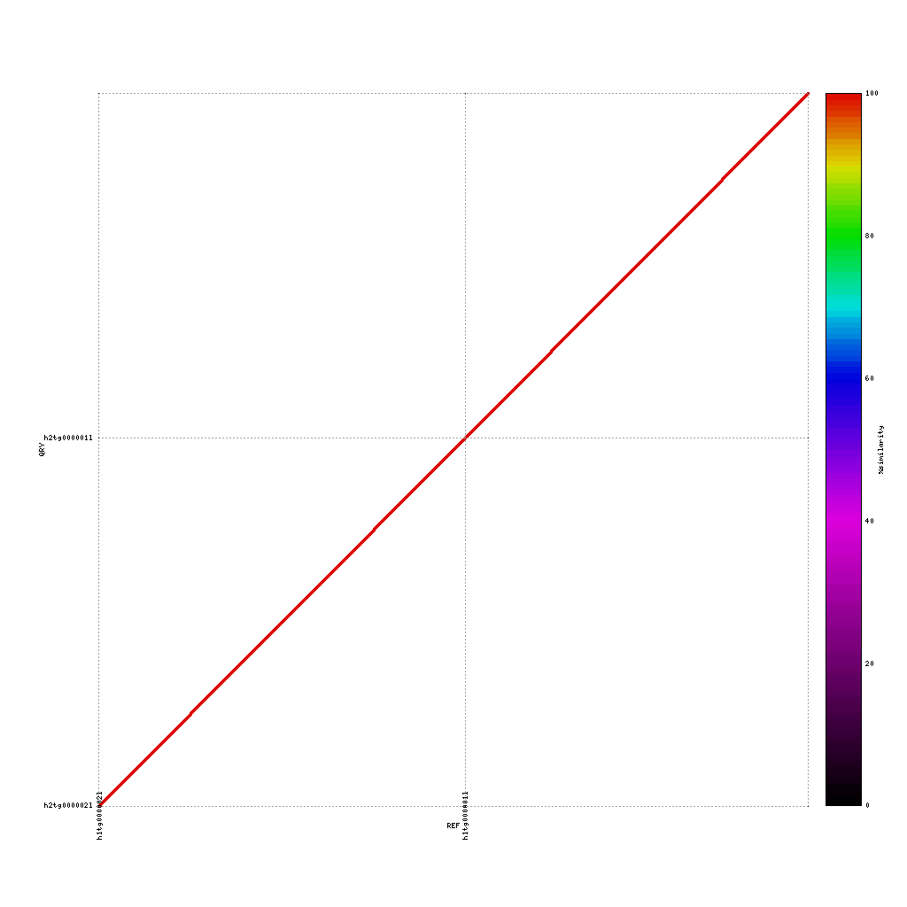
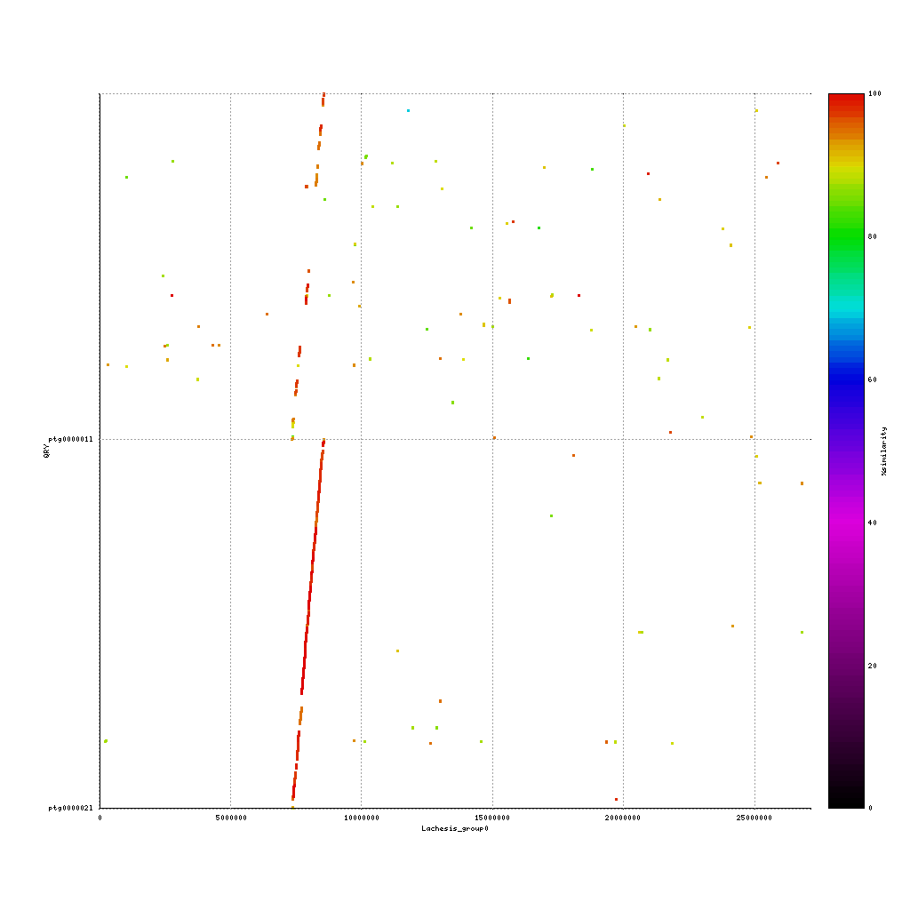
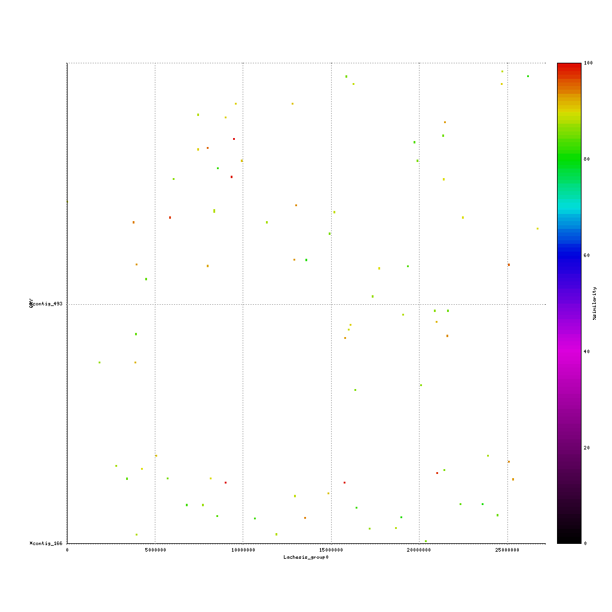
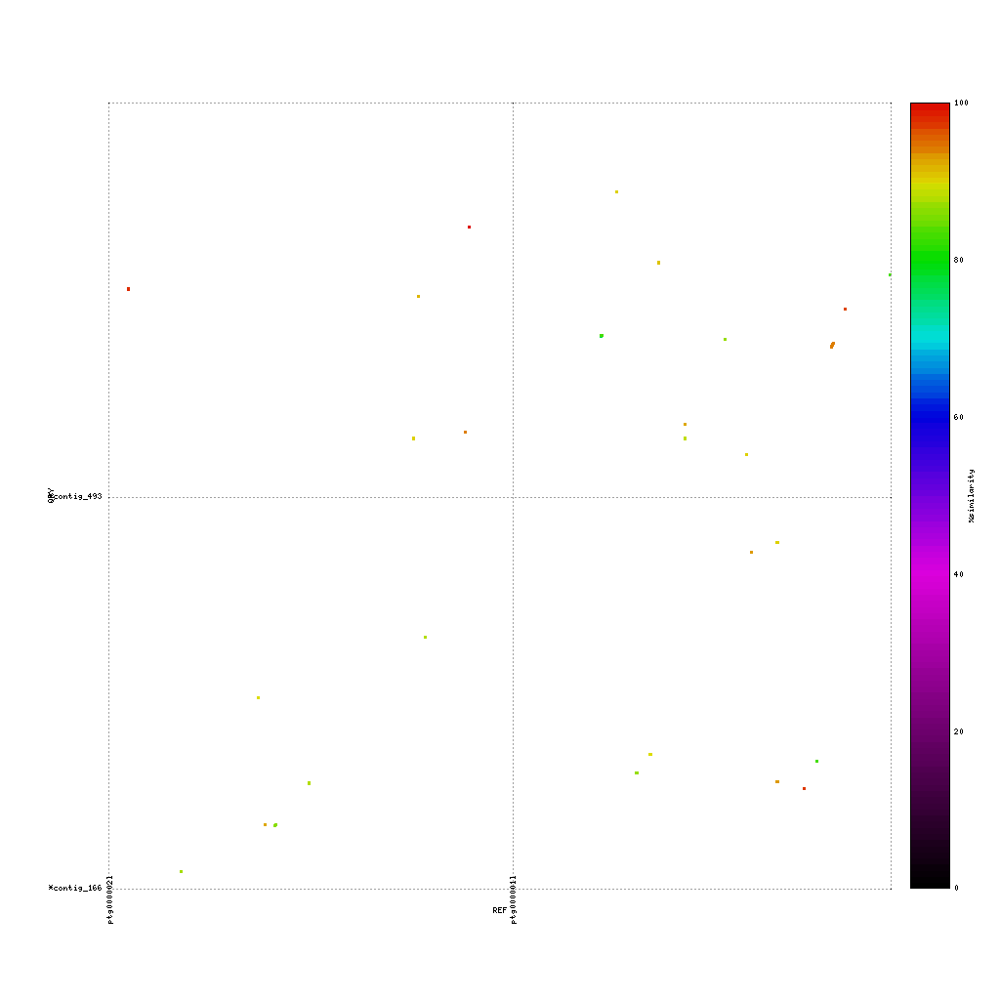
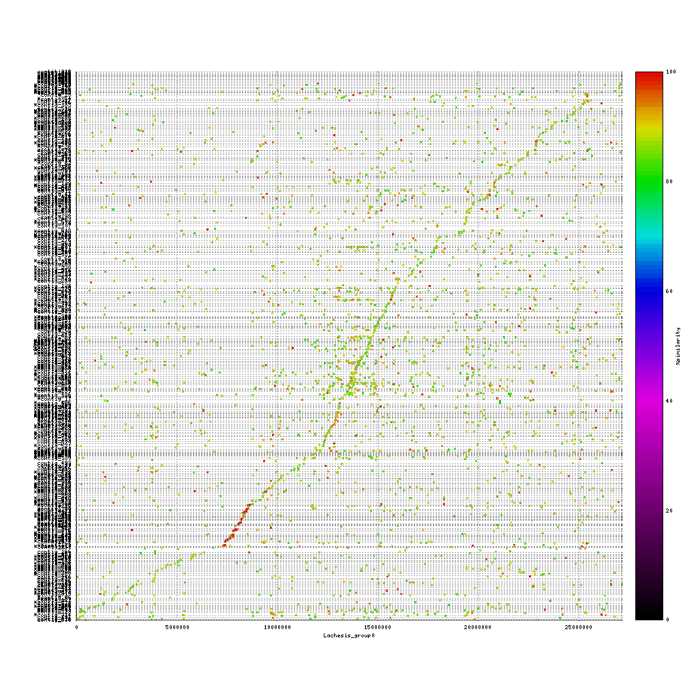

> ## Quast
> The generated assemblies appear to be much larger than expected. We will investigate this further. A key tool in comparing assembly statistics is the tool quast.py.
> Quast outputs many different statistics, like N50, maximum contig length, GC percentage, A50 plot, etc in pdf, text and html formats. Run quast on your assemblies and inspect the results.
> > ## Solution
> >~~~
> > {{site.vm_prompt}}cd ~
> > {{site.vm_prompt}}mkdir quast
> > {{site.vm_prompt}}cd quast
> > {{site.vm_prompt}}quast.py -o all_raw_assemblies -t 6 ~/data/results/hifiasm_hifi/hifiasm_hifi.p_ctg.fa ~/data/results/hifiasm_hifi_sub/hifiasm_hifi_sub.p_ctg.fa ~/data/results/hifiasm_hifi_ont/hifiasm_hifi_ont.p_ctg.fa ~/data/results/flye_hifi_sub/flye_hifi_sub.fasta  ~/data/results/flye_hifi/flye_hifi.fasta ~/data/results/flye_ont_sub/flye_ont_sub.fasta ~/data/results/flye_ont/flye_ont.fasta
> >~~~
> >{: .bash}
> {: .solution}
> Please discuss the following items:
> 1. Given the statistics, which assembly do you prefer?
> 2. What does the GC-plot show and why is this plot relevant?
> 3. Check out the icarus view. What would be a nice length to filter the contigs on to remove the noise and keep the ~2.5mb region?
{: .challenge}
> ## Filtering the assembly
> We can use seqtk to filter the assemblies based on sequence length N:
>~~~
> {{site.vm_prompt}}seqtk seq -L 100000 assembly.fasta > assembly_filtered.fasta
>~~~
>{: .bash}
> Use the length(s) you determined in the previous section to filter the assemblies and run quast on these files to see the effect of this filtering.
> > ## Solution
> > Use for the assemblies based on the full read set a length of 500000 and for the assemblies based on the subsampled read sets a length of 200000.
> > ~~~
> > {{site.vm_prompt}}quast.py -o all_filtered_assemblies -t 6 ~/data/results/hifiasm_hifi/hifiasm_hifi_p.fa ~/data/results/hifiasm_hifi_sub/hifiasm_hifi_sub_p.fa ~/data/results/hifiasm_hifi_ont/hifiasm_hifi_ont_p.fa ~/data/results/flye_hifi_sub/flye_hifi_sub_p.fasta  ~/data/results/flye_hifi/flye_hifi_p.fasta ~/data/results/flye_ont_sub/flye_ont_sub_p.fasta ~/data/results/flye_ont/flye_ont_p.fasta
> > ~~~
> >{: .bash}
> {: .solution}
> Are you satisfied with the results?
{: .challenge}
 

## Evaluating the assemblies through comparisons

A common question to ask after finishing a de novo assembly is how does my new draft sequence looks like compared to either a reference genome or a previously created assembly.

To answer this question, we will use **mummerplot** to align two sequence files to each other and create a nice plot based on these alignments.

The first step is to align two fasta files using **nucmer**. Based on these alignment **mummerplot** will provide a PNG image with the matching regions, colored based on the identity score.

~~~
{{site.vm_prompt}}nucmer REF QUERY --delta=out.delta
{{site.vm_prompt}}mummerplot --color --medium --filter --layout -R REF -Q QUERY --prefix OUTPUT_PREFIX --fat --png out.delta
~~~
{: .bash}

> ## Haplotypes of hifiasm
> Hifiasm generates two haplotpyes, next to the primary assembly. These haplotypes can be very different in many species, so let's see how our haplotypes compare. Use nucmer and mummerplot to create PNG of the comparison and discuss your results. How similar are they for example?
> > ## Solution
> > ~~~
> > {{site.vm_prompt}}mkdir mummer; cd mummer
> > {{site.vm_prompt}}nucmer ../hifiasm_hifi/hifiasm_hifi_hap1.fa ../hifiasm_hifi/hifiasm_hifi_hap2.fa --delta=hifiasm_hifi_hap1_hap2.delta
> > {{site.vm_prompt}}mummerplot --color --medium --filter --layout -Q ../hifiasm_hifi/hifiasm_hifi_hap2.fa -R ../hifiasm_hifi/hifiasm_hifi_hap1.fa --prefix hifiasm_hifi_hap1_hap2 --fat --png hifiasm_hifi_hap1_hap2.delta
> > ~~~
> > {: .bash}
> > 
> {: .solution}
> To verify the results you can map both haplotypes to the primary assembly with minimap2 and visualize the results using Tablet. Can you spot the difference?
> > ## Solution
> > ~~~
> > {{site.vm_prompt}}cd ~/data/results/minimap
> > {{site.vm_prompt}}minimap2 -a -o hifiasm_hap1_hap2.sam -t 3 -x map-hifi ../hifiasm_hifi/hifiasm_hifi_p.fa ../hifiasm_hifi/hifiasm_hifi_hap1.fa  ../hifiasm_hifi/hifiasm_hifi_hap2.fa 
> > ~~~
> > {: .bash}
> > There are two deletions and 1 SNP in Hap2 compared to the primary assembly. Hap1 is exactly the same as the primary assembly.
> {: .solution}
{: .challenge}

> ## Comparison to the kiwifruit reference genome
> Make mummerplots of the filtered assemblies from our previous session compared to the reference kiwifruit contig.
>~~~
> ~/data/genome/kiwi_contig.fa
>~~~
>{: .bash}
> > ## Hifiasm PacBio vs. reference genome
> >~~~
> > {{site.vm_prompt}}nucmer ~/data/genome/kiwi_contig.fa ../hifiasm_hifi/hifiasm_hifi_p.fa --delta=ref_hifiasm_hifi_p.delta
> > {{site.vm_prompt}}mummerplot --color --medium --filter --layout -Q ../hifiasm_hifi/hifiasm_hifi_p.fa -R ~/data/genome/kiwi_contig.fa --prefix ref_hifiasm_hifi_p --fat --png ref_hifiasm_hifi_p.delta
> >~~~
> >{: .bash}
> >
> {: .solution}
> > ## Flye Nanopore vs. reference genome
> >~~~
> > {{site.vm_prompt}}nucmer ~/data/genome/kiwi_contig.fa ../flye_ont/flye_ont_p.fasta --delta=ref_flye_ont_p.delta
> > {{site.vm_prompt}}mummerplot --color --medium --filter --layout -Q ../flye_ont/flye_ont_p.fasta -R ~/data/genome/kiwi_contig.fa --prefix ref_flye_ont_p --fat --png ref_flye_ont_p.delta
> >~~~
> >{: .bash}
> >
> {: .solution}
> Now discuss:
> 
> 1. What do you see? 
> 2. Are the assemblies similar to the reference or not? And why (not)?
> 3. Which sequencing platform do you prefer?
> 
{: .challenge}

> ## Flye ONT assembly
> There seems to something wrong with the Flye ONT assembly. Although the length of the largest contigs are similar to those of the hifiasm hifi assembly, the mummerplot does not show any similarity to the reference genome. To investigate this further, make mummerplots of:
> 
> 1. The hifiasm hifi primary filtered assembly against the flye ont filtered assembly
> 2. The reference genomic region against the unfiltered flye ont assembly
> 
> Inspect the results. What are you observations?
>
> > ## hifiasm hifi primary filtered assembly against the flye ont filtered assembly
> >~~~
> > {{site.vm_prompt}}nucmer ../hifiasm_hifi/hifiasm_hifi_p.fa ../flye_ont/flye_ont_p.fasta --delta=hifiasm_hifi_flye_ont_p.delta
> > {{site.vm_prompt}}mummerplot --color --medium --filter --layout -Q ../flye_ont/flye_ont_p.fasta -R ../hifiasm_hifi/hifiasm_hifi_p.fa --prefix hifiasm_hifi_flye_ont_p --fat --png hifiasm_hifi_flye_ont_p.delta
> >~~~
> >{: .bash}
> >
> {: .solution}
>
> > ## Flye ont unfiltered vs. reference
> >~~~
> > {{site.vm_prompt}}nucmer ~/data/genome/kiwi_contig.fa ../flye_ont/flye_ont.fasta --delta=ref_flye_ont.delta
> > {{site.vm_prompt}}mummerplot --color --medium --filter --layout -Q ../flye_ont/flye_ont.fasta -R ~/data/genome/kiwi_contig.fa --prefix ref_flye_ont --fat --png ref_flye_ont.delta
> >~~~
> >{: .bash}
> >
> {: .solution}
>
> It could be that the supplied data is raw nanopore data (normal base-calling), and not high-quality nanopore data. The latter takes significantly more time to generate and is therefore less common. Investigate this by:
> 
> 1. Creating a Flye assembly using the --nano-raw in stead of the --nano-hq option
> 2. Filter the assembly on length with seqtk seq -L
> 3. Compare the resulting assembly using mummerplot and the reference genome.
>
> > ## New flye ont raw assembly
> > The assembly is also [available for download](https://www.dropbox.com/s/fil3vgc0lhcmtl2/flye_ont_raw.fa?dl=0). 
> > ~~~
> > {{site.vm_prompt}}nucmer ~/data/genome/kiwi_contig.fa ../flye_ont_raw/flye_ont_raw.fa --delta=ref_flye_ont_raw.delta
> > {{site.vm_prompt}}mummerplot --color --medium --filter --layout -Q ../flye_ont_raw/flye_ont_raw.fasta -R ~/data/genome/kiwi_contig.fa --prefix ref_flye_ont_raw --fat --png ref_flye_ont_raw.delta
> > ~~~
> > {: .bash}
> > 
> {: .solution}
> Does this indeed improve the assembly? 
{: .challenge} 
 

